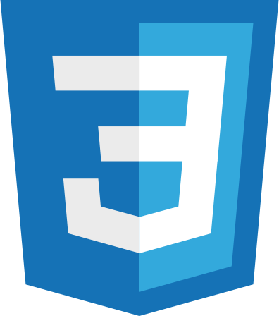
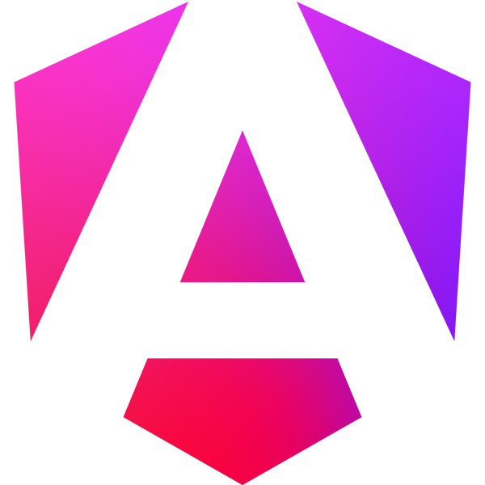
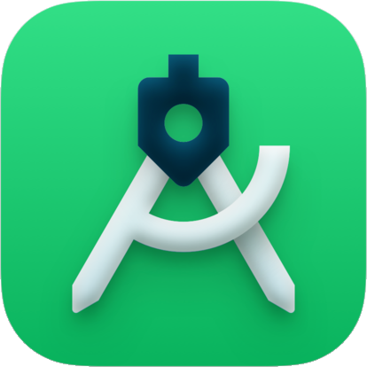
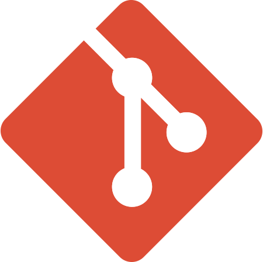
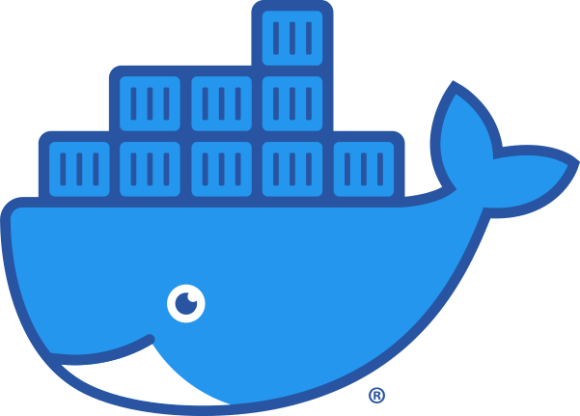

<!--
<h3>Hi there 👋
**JhoemSoftware/JhoemSoftware** is a ✨ _special_ ✨ repository because its `README.md` (this file) appears on your GitHub profile.
Here are some ideas to get you started:
- 🔭 I’m currently working on ...
- 🌱 I’m currently learning ...
- 👯 I’m looking to collaborate on ...
- 🤔 I’m looking for help with ...
- 💬 Ask me about ...
- 📫 How to reach me: ...
- 😄 Pronouns: ...
- ⚡ Fun fact: ...
-->
<!-- 

	

 -->

	

<h1 align='center'>Jhoem Software</h1>

Hi 👋🏼! I'm Jhon Alex Marín, from Medellín 🇨🇴. Full Stack software developer with experience in the implementation of information systems and web development with this skills 👨🏻‍💻

<h3 align='center'>Languages 📒</h3>

<!-- Bash -->

|
<!-- Rust -->

|
<!-- Kotlin -->

|
<!-- JS -->

|
<!-- TS -->

|
<!-- PHP -->

|
<!-- HTML -->

|
<!-- CSS -->

 
<h3 align='center'>Frameworks & Libraries 🧰</h3>

<!-- Actix -->

|
<!-- Express -->

|
<!-- NestJS -->

|
<!-- React -->

|
<!-- Next -->

|
<!-- Angular -->

|
<!-- Vue -->

|
<!-- Laravel -->

|
<!-- Livewire -->

|
<!-- Handlebars -->

|
<!-- Pug -->

|
<!-- Leptos -->

|
<!-- Yew -->

|
<!-- Sass -->

|
<!-- Bootstrap -->

|
<!-- Tailwind -->

 
<h3 align='center'>Databases Languages & Motors 💾</h3>

<!-- Mysql -->

|
<!-- MariaDB -->

|
<!-- Postgres -->

|
<!-- Mongo -->

|
<!-- Redis -->

 
<h3 align='center'>Other skills & Technologies ℹ️</h3>

<!-- Node -->

|
<!-- Android -->

|
<!-- GIT -->

|
<!-- Docker -->

|
<!-- Docker -->

|
<!-- Docker -->

  
<!-- Jest --

<!-- Sql Server --

<!-- Oracle --

-->

    No le digas a Dios que tan grande es el bug 🐞, muéstrale al bug ... que tan grande es <b>Dios</b> 😀
     <a href="https://jhoemsoftware.netlify.app/" target="_blank" align='center'>jhoemsoftware.com</a>

    
    
    
    

