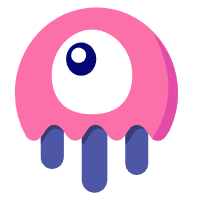
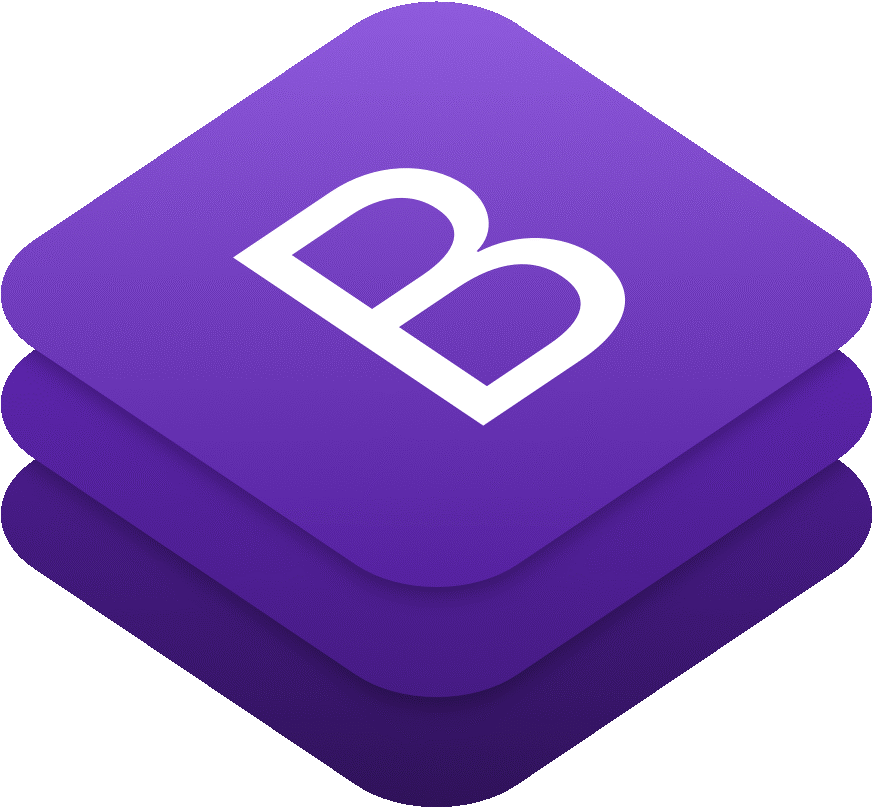

<!--
### Hi there 👋
**JhoemSoftware/JhoemSoftware** is a ✨ _special_ ✨ repository because its `README.md` (this file) appears on your GitHub profile.
Here are some ideas to get you started:
- 🔭 I’m currently working on ...
- 🌱 I’m currently learning ...
- 👯 I’m looking to collaborate on ...
- 🤔 I’m looking for help with ...
- 💬 Ask me about ...
- 📫 How to reach me: ...
- 😄 Pronouns: ...
- ⚡ Fun fact: ...
-->
<!-- 

	

 -->

	

<h1 align='center'>Software</h1>

Hi 👋🏼! I'm Jhon Alex Marín, from Medellín  🇨🇴. Full Stack software developer with two years of experience in the implementation of information systems and web development with this skills 👨🏻‍💻

<!-- GIT -->

<!-- Docker -->

<!-- Rust -->

<!-- Actix -->

<!-- Node -->

<!-- Express -->

<!-- NestJS -->

<!-- Jest -->

<!-- Laravel -->

<!-- Livewire -->

<!-- Mysql -->

<!-- MariaDB -->

<!-- Postgres -->

<!-- Mongo -->

<!-- PHP -->

<!-- JS -->

<!-- TS -->

<!-- React -->

<!-- Next -->

<!-- Vue -->

<!-- Angular -->

<!-- HTML -->

<!-- CSS -->

<!-- Bootstrap -->

<!-- Tailwind -->

No le digas a Dios que tan grande es el bug 🐞, muéstrale al bug ... que tan grande es <b>Dios</b> 😀 
<a href="https://jhoemsoftware.netlify.app/" target="_blank" align='center'>jhoemsoftware.com</a>

  
  
  
  

