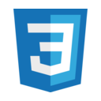
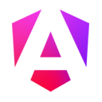
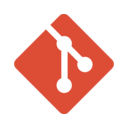

  

<h1 align="center">Jhoem Software</h1>

  Hi 👋🏼! I'm <b>Jhon Alex Marín</b>, from Medellín 🇨🇴. 
  Full Stack software developer since 2018, focused on web development and information systems.

## ⚡ Currently

- 💼 Applications Analyst at **Procrédito** (Fenalco Antioquia) since 2020.
- 🏦 6 years building internal information systems for the credit & financial services sector.
- 🦀 Learning **Rust**, currently exploring **Actix** for backend services and **Leptos** for web apps.
- 🐍 Learning **Python**, using it on a weekly basis.
- 🤖 Exploring workflow automation with **n8n**.
- 🌐 Working on freelance web and Android projects.
- 🗣️ Spanish (native) · English (technical reading, improving conversation).

<!--
TODO (Jhoem): Featured projects section, hidden until there are public projects to show.
Pending:
  1. Build a first public Rust project (e.g. a REST API with Actix or a small Leptos app).
  2. Publish it on GitHub with its own README.
  3. Fill in the table below and remove this comment wrapper.

## 🚀 Featured projects

| Project | Description | Stack |
|-|-|-|
| [project-name](https://github.com/JhoemSoftware/project-name) | Short description | Rust · Actix |
| [JhoemSoftwareWebReact](https://github.com/JhoemSoftware/JhoemSoftwareWebReact) | Personal website | React |
-->

<!-- Languages -->
<h3 align="center">Languages 📒</h3>

   |
   |
   |
   |
   |
   |
  

<!-- Languages: learning -->

<b>Currently learning</b>

   |
  

<!-- Frameworks: main -->
<h3 align="center">Frameworks & Libraries 🧰</h3>

   |
   |
   |
   |
   |
   |
  

<!-- Frameworks: familiar -->

<b>Also familiar with</b>

  <a href="https://expressjs.com/">
    <picture>
      <source media="(prefers-color-scheme: dark)" srcset="./images/express-dark.png">
      
    </picture>
  </a> |
   |
   |
  <a href="https://handlebarsjs.com/">
    <picture>
      <source media="(prefers-color-scheme: dark)" srcset="./images/handlebars-dark.png">
      
    </picture>
  </a> |
   |
   |
  

<!-- Databases -->
<h3 align="center">Databases & Engines 💾</h3>

  <a href="https://www.mysql.com/">
    <picture>
      <source media="(prefers-color-scheme: dark)" srcset="./images/mysql-dark.png">
      
    </picture>
  </a> |
   |
   |
   |
   |
  <a href="https://www.mongodb.com/">
    <picture>
      <source media="(prefers-color-scheme: dark)" srcset="./images/mongo-dark.png">
      
    </picture>
  </a> |
  

<!-- Tools & Technologies -->
<h3 align="center">Tools & Technologies ℹ️</h3>

   |
   |
   |
   |
   |
   |
  

<!-- Contact -->

  <i>"Don't tell God how big the bug 🐞 is, show the bug how big <b>God</b> is"</i> 😀
   
  <a href="https://jhoemsoftware.netlify.app/">jhoemsoftware.netlify.app</a>

  
  
  
  

