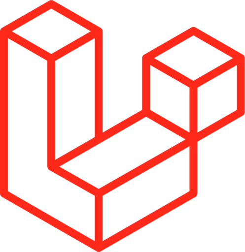

<!--
### Hi there 👋
**JhoemSoftware/JhoemSoftware** is a ✨ _special_ ✨ repository because its `README.md` (this file) appears on your GitHub profile.
Here are some ideas to get you started:
- 🔭 I’m currently working on ...
- 🌱 I’m currently learning ...
- 👯 I’m looking to collaborate on ...
- 🤔 I’m looking for help with ...
- 💬 Ask me about ...
- 📫 How to reach me: ...
- 😄 Pronouns: ...
- ⚡ Fun fact: ...
-->
<!-- 

	

 -->

	

<h1 align='center'>Jhoem Software</h1>

Hi 👋🏼! I'm Jhon Alex Marín, from Medellín  🇨🇴. Full Stack software developer with experience in the implementation of information systems and web development with this skills 👨🏻‍💻

    <!-- GIT -->
    
    <!-- Docker -->
    
    <!-- Rust -->
    
    <!-- Actix -->
    
    <!-- Node -->
    
    <!-- Express -->
    
    <!-- NestJS -->
    
    <!-- Jest --
    
    <!-- Redis -->
    
    <!-- Sql Server --
    
    <!-- Oracle --
    
    <!-- Mysql -->
    
    <!-- MariaDB -->
    
    <!-- Postgres -->
    
    <!-- Mongo -->
    
    <!-- PHP -->
    
    <!-- JS -->
    
    <!-- TS -->
    
    <!-- React -->
    
    <!-- Next -->
    
    <!-- Vue -->
    
    <!-- Angular -->
    <!--  -->
    <!-- Yew -->
    
    <!-- Leptos -->
    
    <!-- Livewire -->
    
    <!-- Laravel -->
    
    <!-- Handlebars -->
    
    <!-- Pug -->
    
    <!-- HTML -->
    
    <!-- CSS -->
    
    <!-- Sass -->
    
    <!-- Bootstrap -->
    
    <!-- Tailwind -->
    

    No le digas a Dios que tan grande es el bug 🐞, muéstrale al bug ... que tan grande es <b>Dios</b> 😀
     <a href="https://jhoemsoftware.netlify.app/" target="_blank" align='center'>jhoemsoftware.com</a>

    
    
    
    

